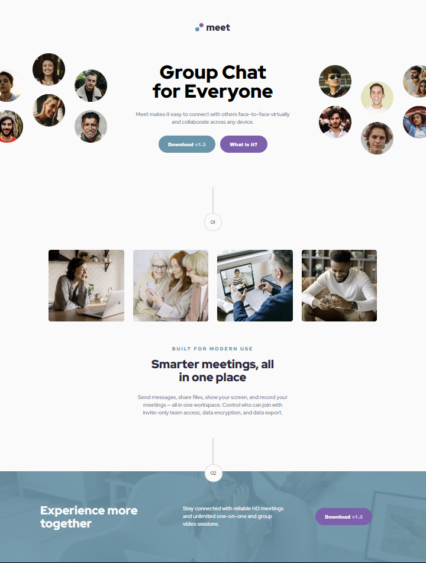
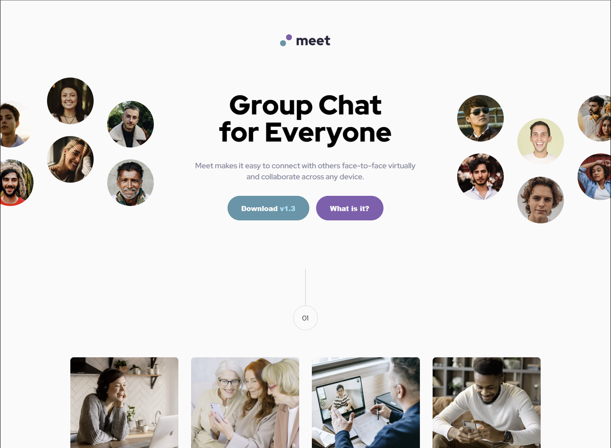
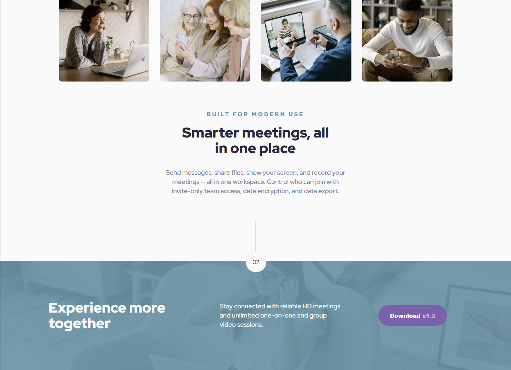

# Frontend Mentor - Meet landing page solution

This is a solution to the [Meet landing page challenge on Frontend Mentor](https://www.frontendmentor.io/challenges/meet-landing-page-rbTDS6OUR).

## Table of contents

- [Overview](#overview)
  - [The challenge](#the-challenge)
  - [Screenshot](#screenshot)
  - [Links](#links)
- [My process](#my-process)
  - [Built with](#built-with)
  - [What I learned](#what-i-learned)
  - [Continued development](#continued-development)
- [Author](#author)
- [Acknowledgments](#acknowledgments)

## Overview

### The challenge

The purpose of this project was to practice styling a product landing page with the following challenges:
- Use the html <picture> to change out pictures as the pages adapt from desktop size (1400px) to tablet size (765px) and finally, to mobile phone size (375px).
- Systematize and track the changes for each of the @media variations
- Use flexbox and grid to structure the site and adapt the flex-direction, or turn the grid on and off according to the changes in size.
- Incorporate 3 hover effects (ober the buttons).
- For this challenge, I chose to use only html and css.

### Screenshot

Below are listed the screenshots of the desktop only. Screenshots of the tablet size and the mobile are in the repository in the "screenshots" folder.

### Links

- Solution URL: [GitHub Repository: FMC-Meet-Landing-Page](https://github.com/jguleserian/FMC-MeetLandingPage.git)
- Live Site URL: [GitHub Pages for FMC-MeetLandingPage](https://jguleserian.github.io/FMC-MeetLandingPage/)

## My process

I utilized my regular process, i.e.:
- adding content
- structuring the content with html
- linking style sheets, fonts, etc.
- used css to reset the style, create variables, and organize styles so they would be easy to find. In this case I organized them by main sections with their child containers listed below them. Independent classes, id's etc came later. Media queries came at the end.
- I used Edge Developer Tools and Figma to walk throuh the styles from top to bottom, first with desktop, then with tablet, then with mobile.
- In the end, I compared the design closely with the Figma drawing and made adjustments.

### Built with

- Semantic HTML5 markup
- CSS custom properties
- Flexbox
- CSS Grid
- Edge Developer Tools
- Figma (drawings were included in the challenge)

### What I learned

In this challenge, I tried utilizing a different approach to organizing my css code. Parent and child containers were listed together and classes and ids were listed alphabetically afterward. While this was certainly easier to navigate when I needed to find a setting, I felt like the individual classes got lost from the flow.

While my skill level is progressing, I can see that there are some areas that need to be shorne up before I move forward too quickly. One of these is the syntax (without looking it up again) of the <picture> element. Related to this is finally understanding the best way to refer to the individual images in the css code. This challenge was helpful in making me walk through this exercise.

Finally, I learned some awesome tools in the Edge Developer Tools. I temporarily placed all my desktop css into a media query so I could use the Edge tools to toggle to each of the sizes with a single click.

### Continued development

I think I am ready to handle some more advanced css concepts. I have a plan to master SASS and try to use it, along with JavaScript in my next project. If the JavaScript calls for it, I will also make use of JQuery, something I am already familiar with.

## Author

- Website - [@jguleserian](https://www.github.com/jguleserian)
- Frontend Mentor - [@yjguleserian](https://www.frontendmentor.io/profile/jguleserian)
- LinkedIn - [@jeffguleserian](https://www.linkedin.com/jeffguleserian)

## Acknowledgments

While I did this project mostly on my own, I sincerely appreciate the feedback I have received from FrontEnd Mentor and my peers there.
